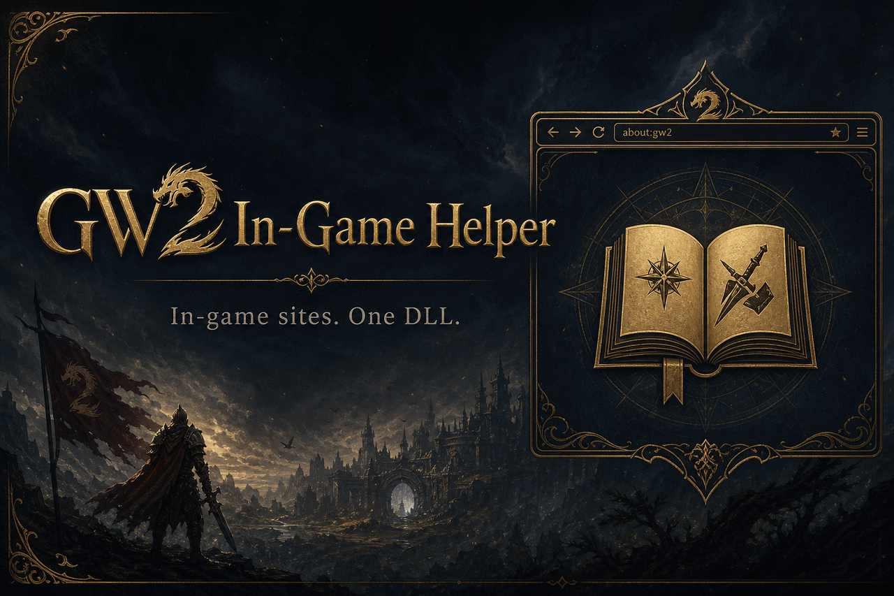

# GW2 In-Game Helper

<p align="center">
  
</p>

A Raidcore Nexus addon that opens useful Guild Wars 2 websites and community
Discords inside the game. One DLL — pick Wiki, builds, tools, guides, and more
from an in-game browser. No memory reads; uses Nexus APIs and the game’s built-in CEF.

**Version:** `1.7.7.0` · **Signature:** `0x48454C50` (`HELP`) · **License:** MIT

**Install:** copy `GW2-InGame-Helper.dll` into `<GW2>/addons/`. That’s it.
Runtime files (helper, homepage, settings) extract into `<GW2>/addons/GW2-InGame-Helper/`.

| Site | Category |
|------|----------|
| How to use (built-in) | Help |
| [Google](https://www.google.com/) | Search |
| [DuckDuckGo](https://duckduckgo.com/) | Search |
| [Guild Wars 2](https://www.guildwars2.com/) | Official |
| [GW2 News](https://www.guildwars2.com/en/news/) | Official |
| [Raidcore](https://raidcore.gg/gw2) | Official |
| [Forums](https://en-forum.guildwars2.com/) | Official |
| [Guild Wars 2 Wiki](https://wiki.guildwars2.com/) | Wiki |
| [Game Updates](https://wiki.guildwars2.com/wiki/Game_updates) | Wiki |
| [Legendaries](https://wiki.guildwars2.com/wiki/Legendary_equipment) | Wiki |
| [Mounts](https://wiki.guildwars2.com/wiki/Mount) | Wiki |
| [Snowcrows](https://snowcrows.com/) | Builds |
| [MetaBattle](https://metabattle.com/wiki/MetaBattle_Wiki) | Builds |
| [MetaBattle OW](https://metabattle.com/wiki/Open_World) | Builds |
| [Accessibility Wars](https://aw2.help/) | Builds |
| [Gw2Skills Editor](https://en.gw2skills.net/editor/) | Builds |
| [MetaBattle PvP](https://metabattle.com/wiki/PvP_Builds) | PvP |
| [MetaBattle WvW](https://metabattle.com/wiki/WvW) | WvW |
| [gw2efficiency](https://gw2efficiency.com/) | Tools |
| [Legendary Tracker](https://gw2efficiency.com/account/legendaries) | Tools |
| [Blish HUD](https://blishhud.com/) | Tools |
| [GW2Timer Events](https://gw2timer.com/) | Tools |
| [GW2Timer Map](https://gw2timer.com/?page=Map) | Tools |
| [Meta Timers](https://gw2tldr.com/metas) | Tools |
| [GW2 Crafts](https://gw2crafts.net/) | Tools |
| [Music Box](http://gw2mb.com/) | Tools |
| [Peu Research Center](https://peuresearchcenter.com/index.html) | Tools |
| [KillProof](https://killproof.me/) | Tools |
| [Wingman](https://gw2wingman.nevermindcreations.de/) | Tools |
| [GW2BLTC](https://www.gw2bltc.com/) | Tools |
| [GW2 Treasures](https://gw2treasures.com/) | Tools |
| Raid Food (built-in) | Cheat Sheets |
| Uber's All-In-One (built-in) | Cheat Sheets |
| Raid Utilities (built-in) | Cheat Sheets |
| Fractal Consumables (built-in) | Cheat Sheets |
| Sigils & Runes (built-in) | Cheat Sheets |
| Relics (built-in) | Cheat Sheets |
| Boon Checklist (built-in) | Cheat Sheets |
| CC / Defiance (built-in) | Cheat Sheets |
| Raid Wings (built-in) | Cheat Sheets |
| Home Garden (built-in) | Cheat Sheets |
| Strike Missions (built-in) | Cheat Sheets |
| Fractal CM / T4 (built-in) | Cheat Sheets |
| Squad Template (built-in) | Cheat Sheets |
| Stability / Cleanse (built-in) | Cheat Sheets |
| Material Conversions (built-in) | Cheat Sheets |
| Legendary Paths (built-in) | Cheat Sheets |
| Mount Unlock (built-in) | Cheat Sheets |
| Daily / Weekly (built-in) | Cheat Sheets |
| Currency Sinks (built-in) | Cheat Sheets |
| Ascended Start (built-in) | Cheat Sheets |
| Portals / Pulls (built-in) | Cheat Sheets |
| Homestead (built-in) | Cheat Sheets |
| WvW Consumables (built-in) | Cheat Sheets |
| [Guildjen](https://guildjen.com/) | Guides |
| [Living World](https://guildjen.com/gw2-living-world-guides/) | Guides |
| [Leveling](https://metabattle.com/wiki/Guide:Leveling_Up) | Guides |
| [Earn Gold](https://metabattle.com/wiki/Guide:Ways_to_Earn_Gold) | Guides |
| [Griffon Unlock](https://metabattle.com/wiki/Guide:How_to_Unlock_the_Griffon_Mount) | Guides |
| [Skyscale Unlock](https://metabattle.com/wiki/Guide:How_to_Unlock_the_Skyscale_Mount) | Guides |
| [Mukluk Fractals](https://mukluklabs.com/gw2-fractal-guides) | Guides |
| [GW2 TLDR](https://gw2tldr.com/) | Guides |
| [TLDR Raids](https://gw2tldr.com/raids) | Guides |
| [TLDR Fractals](https://gw2tldr.com/fractals) | Guides |
| [Fast Farming Community](https://fast.farming-community.eu/) | Farming |
| Official · Community · Snowcrows · MetaBattle · Guildjen · Mukluk · Accessibility Wars · Skein Gang · Fractal Training · Raid Academy · GW2 University · Crossroads Inn · Raid Training EU · Welcome to PvP · WvW NA/EU Alliance · Fast Farming · Raidcore · Overflow Trading · GW2 Central Hub | Discord |

Add more sites in `src/Sites.cpp`. Hardstuck and Discretize are intentionally omitted (outdated).
Replaces the older Wiki / Snowcrow browser addons.
Works on Windows and on Linux via Wine/Proton.

> **Players only need the DLL** in `addons/`. The browser helper and homepage assets extract into `addons/GW2-InGame-Helper/` on first use; Chromium comes from the game’s `bin64/cef`.

Full HTML listing copy (Nexus / Raidcore / web): [`docs/description.html`](docs/description.html) · [`docs/RAIDCORE.md`](docs/RAIDCORE.md) · [`docs/RELEASE_NOTES.md`](docs/RELEASE_NOTES.md)

## Features

- In-game CEF browser with **Browse** panel (search + categories)
- **Compact toolbar** — Browse · nav cluster · Search · `...` menu (Find / Copy / Open Ext)
- **GW2-themed** chrome (gold tabs + muted status); Browse picker with section headers (Tools, Guides, Discord, Cheat Sheets, …)
- **Tabs** — up to 8 live pages; **pin** (gold mark), reopen closed; titles follow the page; persisted
- **Tab hotkeys** — `Ctrl+T` new tab · `Ctrl+W` close · `Ctrl+Tab` cycle · `Ctrl+Shift+T` reopen
- **Find in page** — Ctrl+F
- **Favorites** — star + drag-reorder
- **Keep browser warm** — optional hide without killing CEF
- **Default landing site** — Options picker; used by the Home button and when no tabs are saved
- Nexus **QuickAccess** icon at the top of the screen
- Hotkeys: `Ctrl+Shift+H` (or `K`) open / close · QuickAccess icon
- Home / Back / Forward / Reload toolbar
- Branded how-to homepage (logo + cover art) on first open
- **Cheat Sheets** category — offline pages including **Daily / Weekly**, **Currency Sinks**, **Ascended Start**, **Portals / Pulls**, **Homestead**, **WvW Consumables**, plus Uber's, Food, Utilities, Fractals, Sigils, Relics, Boons, Squad, Stab/Cleanse, CC, Wings, Strikes, Mats, Legendaries, Mounts, Garden
- **Copy URL** and **Open Ext** (system browser — Discord joins / logins)
- Single DLL — browser helper and homepage assets are embedded and extracted on first use
- **No Guild Wars 2 memory reads** — official Nexus APIs only

## Requirements

- Guild Wars 2 (64-bit Windows client)
- [Raidcore Nexus](https://raidcore.gg/gw2/nexus) installed and working
- **Only** the release file `GW2-InGame-Helper.dll` (nothing else)

## Install (players)

Players need **one file**. No separate helper `.exe`, CEF package, or WebView2.

1. Close Guild Wars 2.
2. Copy `GW2-InGame-Helper.dll` into your game’s `addons` folder:

   ```text
   <Guild Wars 2>/addons/GW2-InGame-Helper.dll
   ```

   Do **not** put the DLL inside `addons/GW2-InGame-Helper/`. That folder is created automatically for runtime data (helper exe, homepage HTML, settings).

3. Start the game, open Nexus with `Ctrl+O`, and enable **GW2-InGame-Helper** if needed.
4. Restart if Nexus asks you to.

The DLL embeds its browser helper. On first use it extracts `GW2HelperBrowser.exe`
into the addon’s Nexus directory and loads CEF from the game’s existing
`bin64/cef` folder. Do **not** download or ship a separate CEF runtime or helper
exe — players only install the DLL.

### Common install paths

**Windows (Steam)**

```text
C:\Program Files (x86)\Steam\steamapps\common\Guild Wars 2
```

**Linux (Steam)**

```text
~/.local/share/Steam/steamapps/common/Guild Wars 2
```

## How to use

| Action | Default |
|--------|---------|
| Open / close helper | `Ctrl+Shift+H` (or `K`) or QuickAccess icon |
| Rebind toggle | `Ctrl+O` → `KB_HELPER_TOGGLE` |

1. Open the helper — it starts on the how-to **Home** page.
2. Click **Browse** — search or pick a category, then a site.
3. Click inside the page to interact.
4. Use **Back**, **Forward**, **Home**, and **Reload** as needed.
5. Click outside the window (on the game) to return movement/skills to Guild Wars 2.

Opacity, font scale, and related options live in the addon’s Nexus options panel. Window size and position are saved automatically.

## Updating

Nexus can auto-update from GitHub Releases (`UP_GitHub` → [Xydroc-IO/GW2-InGame-Helper](https://github.com/Xydroc-IO/GW2-InGame-Helper)).

Manual update:

1. Close Guild Wars 2.
2. Replace `addons/GW2-InGame-Helper.dll` with the new build.
3. Start the game again.

## Build from source

### Dependencies (submodules)

```bash
git clone --recurse-submodules <this-repo-url>
cd GW2-InGame-Helper
# or, if already cloned:
git submodule update --init --recursive
```

| Submodule | Source |
|-----------|--------|
| `deps/nexus` | [Raidcore Nexus API](https://github.com/RaidcoreGG/RCGG-lib-nexus-api) |
| `deps/imgui` | [Raidcore imgui fork](https://github.com/RaidcoreGG/imgui) |
| `deps/cef` | CEF headers only (runtime comes from the game) |

### Linux (MinGW cross-compile)

```bash
# Arch / Manjaro
sudo pacman -S --needed mingw-w64-gcc make git

make -j"$(nproc)"
```

Output:

```text
build/bin/GW2-InGame-Helper.dll
```

Install into a local GW2 tree (default Steam path on Linux):

```bash
make install
# or:
make install GW2_ROOT="/path/to/Guild Wars 2"
```

Clean:

```bash
make clean
```

### CMake (optional)

```bash
cmake -S . -B build -DCMAKE_TOOLCHAIN_FILE=cmake/mingw-w64.cmake
cmake --build build -j"$(nproc)"
```

## Adding another site

Edit `src/Sites.cpp` and append a `SiteDef`:

```cpp
{
    "hardstuck",                         // unique id (saved in settings)
    "Builds",                            // category (group header in picker)
    "Hardstuck",                         // dropdown label
    "Hardstuck",                         // window/title hint
    "https://hardstuck.gg/",             // Home URL
    nullptr,                             // optional search URL prefix
    nullptr,                             // optional search URL suffix
},
```

Keep sites with the same category contiguous so the picker groups them. Rebuild and reinstall.

For search bars, set `searchUrlPrefix` / `searchUrlSuffix` so a query becomes `prefix + urlencode(query) + suffix`.

### Built-in cheat sheets

Offline **Cheat Sheets** use `about:` URLs (e.g. `about:raid-food`, `about:ubers-aio`) resolved to local HTML under the addon data folder.

| Page | Sources |
|------|---------|
| Raid Food | `src/RaidFood.cpp` |
| Other sheets (incl. Uber's All-In-One) | `src/CheatSheets.cpp` |

**Uber's All-In-One** (`about:ubers-aio`) — waypoint / landmark chat codes (hubs, Wizard’s Vault, Chak Egg, Obsidian, Provisioner). Click a code to copy, paste in game chat, click the link to travel. Waypoint list curated by **uberduber.1249**.

Wire new sheets in `CheatSheets.cpp`, add a `SiteDef` in `Sites.cpp`, and map the `about:` URL in `WikiBrowser.cpp` / `helper/main.cpp`.

## Troubleshooting

**Addon does not appear**

- Confirm Nexus opens with `Ctrl+O`.
- Filename must be exactly `GW2-InGame-Helper.dll` under `<GW2>/addons`.
- Enable the addon in Nexus and restart.

**Window does not open**

- Try `Ctrl+Shift+H` or the top QuickAccess icon.
- Check Nexus for a conflicting `KB_HELPER_TOGGLE` bind.
- In addon options, enable **Show helper window**.

**Page stuck loading**

- Confirm `bin64/cef/libcef.dll` exists in the game install.
- Allow `GW2HelperBrowser.exe` if antivirus blocks it.
- Fully quit and restart the game.

**Typing / clicking feels wrong**

- Click inside the rendered page first.
- Click the game outside the window to release keyboard focus.
- Restart after replacing the DLL (hotloading is disabled for this addon).

## Policy & compliance

Intended to stay within ArenaNet’s
[Third-Party Programs](https://help.guildwars2.com/hc/en-us/articles/360013625034-Policy-Third-Party-Programs)
policy and [Raidcore’s Addon Policy](https://raidcore.gg/gw2/addon-policy).

ArenaNet does not endorse third-party software. Use at your own risk. Not affiliated with ArenaNet, NCSoft, Guild Wars 2, or Snow Crows.

### Does **not**

- Read or write Guild Wars 2 process memory
- Use MinHook / Detours / IAT hooks or patch game code
- Use Nexus `MinHook_*`, `DataLink_*`, or MumbleLink
- Automate combat, inventory, trading, or economy
- Bot, macro unattended play, or spoof packets
- Modify `Gw2-64.exe` or ArenaNet game DLLs

### Does

- Use official Nexus APIs (ImGui, render callbacks, keybinds, WndProc, paths, logging, D3D11 texture)
- Open public websites in a separate helper process
- Load the game’s CEF runtime **read-only** into that helper
- Share pixels/input via local shared-memory IPC
- Block keyboard from the game only while the page has focus
- Blocks keyboard from the game only while the page has focus

## How it works

1. `GW2-InGame-Helper.dll` — Nexus UI, site picker, QuickAccess, D3D11 texture.
2. Embedded `GW2HelperBrowser.exe` — loads `<GW2>/bin64/cef/libcef.dll` (read-only).
3. CEF renders off-screen into shared memory.
4. CSS is downleveled for Chromium 103 where needed; common ad/consent hosts are blocked.
5. HTTP cache lives under `%TEMP%` (not under `addons`).
6. Runtime data (helper exe, homepage, cheat sheets, settings) lives under `addons/GW2-InGame-Helper/`.
7. Site list lives in `src/Sites.cpp`; built-in sheets in `RaidFood.cpp` / `CheatSheets.cpp`.

## License

This project is licensed under the [MIT License](LICENSE).

### Third-party

| Component | License | Notes |
|-----------|---------|--------|
| [Raidcore Nexus API](https://github.com/RaidcoreGG/RCGG-lib-nexus-api) (`deps/nexus`) | MIT | Headers only |
| [Dear ImGui](https://github.com/RaidcoreGG/imgui) (`deps/imgui`) | MIT | Raidcore fork |
| CEF headers (`deps/cef`) | BSD-style (Chromium Embedded Framework) | Headers only; runtime `libcef.dll` is shipped by Guild Wars 2 |

Guild Wars 2, its CEF runtime, and related trademarks belong to ArenaNet / NCSoft.
This project is not affiliated with them.
