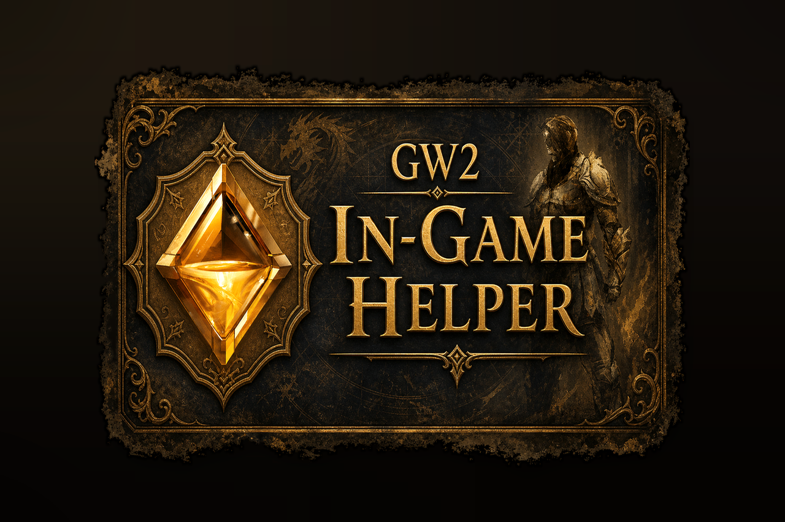

# GW2 In-Game Helper

<p align="center">
  
</p>

Raidcore Nexus in-game browser for Guild Wars 2. Chromium comes from a **private
CEF Stable 150** runtime downloaded on first open into
`addons/GW2-InGame-Helper/cef/` — not from Guild Wars 2 `bin64/cef`.

**Version:** `2.2.0.0` · **Signature:** `0x48454C50` (`HELP`) · **License:** MIT

**Docs:** [`docs/DOCUMENTATION.md`](docs/DOCUMENTATION.md) · [`CONTRIBUTING.md`](CONTRIBUTING.md) ·
[`docs/ONBOARDING.md`](docs/ONBOARDING.md) · [`SECURITY.md`](SECURITY.md) ·
[`docs/ARCHITECTURE.md`](docs/ARCHITECTURE.md) · [`docs/WHITEPAPER.md`](docs/WHITEPAPER.md)

**Install:** copy `GW2-InGame-Helper.dll` into `<GW2>/addons/`.
On first helper open the addon downloads the CEF runtime (~170MB zip) once.
Helper EXE and homepage assets extract into `<GW2>/addons/GW2-InGame-Helper/`.

**Changelog:** [`docs/RELEASE_NOTES.md`](docs/RELEASE_NOTES.md) (version history lives there, not in this README).

| Site | Category |
|------|----------|
| How to use (built-in) | Help |
| [New Player Guide](https://wiki.guildwars2.com/wiki/User:Dak393/New_player_Guide) | Help |
| DPS Log Setup Help (built-in) | Help |
| API Key Setup (built-in) | Help |
| [Guild Wars 2](https://www.guildwars2.com/) | Help |
| [GW2 News](https://www.guildwars2.com/en/news/) | Help |
| [Raidcore](https://raidcore.gg/gw2) | Help |
| [Forums](https://en-forum.guildwars2.com/) | Help |
| [Google](https://www.google.com/) | Search |
| [DuckDuckGo](https://duckduckgo.com/) | Search |
| [Gemini](https://gemini.google.com/app) | Search |
| News Digest (built-in) | Help |
| Account (side-rail **Account** — unlocks, inventory, history, stash, vault, TP, crafting, progress) | ImGui |
| TP Watchlist (Account / pad) | ImGui |
| Item Lookup (Account / pad) | ImGui |
| Wallet & Stash (Account / pad) | ImGui |
| Vault (Account / pad) | ImGui |
| DPS Logs (side-rail **DPS Logs**) | ImGui |
| World Events (side-rail **Events**) | ImGui |
| Pathing (side-rail) | ImGui + MumbleLink · Tekkit + Lady + Hero + user `.taco` |
| Direction compass (side-rail **Compass**) | World N/E/S/W (Nexus FontBig; letter size + radius) |
| Notes + Waypoints (side-rail **Notes**) | ImGui |
| [Guild Wars 2 Wiki](https://wiki.guildwars2.com/) | Wiki |
| [Game Updates](https://wiki.guildwars2.com/wiki/Game_updates) | Wiki |
| [Legendaries](https://wiki.guildwars2.com/wiki/Legendary_equipment) | Wiki |
| Legendary Armory (Armor / Weapons / Accessory / Amulet / Rings / Back / Upgrade Components) | Wiki |
| Cosmetic Infusions (per-infusion wiki pages + Guildjen how-to) | Wiki |
| Lifestyle (Fishing, Jade Bot, Skiff, Home Instance, Homestead) | Wiki |
| Crafting (disciplines + related wiki pages) | Wiki |
| Food + Ascended Food + Utility (by attribute) · Minis (by wiki subsections) | Wiki |
| Utility (utility item hubs) | Wiki |
| Upgrades (Superior Runes, Relics, Superior Sigils) | Wiki |
| [Mounts](https://wiki.guildwars2.com/wiki/Mount) | Wiki |
| [Special Events](https://wiki.guildwars2.com/wiki/Special_Event) · [World Boss Rush](https://wiki.guildwars2.com/wiki/World_Boss_Rush) · [Fractal Rush](https://wiki.guildwars2.com/wiki/Fractal_Rush) · [WvW Rush](https://wiki.guildwars2.com/wiki/World_vs._World_Rush) · [Dungeon Rush](https://wiki.guildwars2.com/wiki/Dungeon_Rush) · [PvP Rush](https://wiki.guildwars2.com/wiki/Player_vs._Player_Rush) | Wiki |
| [SC Raid Builds](https://snowcrows.com/builds/raids) | Builds |
| SC Raid Elementalist / Mesmer / Necromancer / Engineer / Ranger / Thief / Guardian / Revenant / Warrior | Builds |
| [MB Raid Builds](https://metabattle.com/wiki/Raid_Builds) | Builds |
| MB Raid Elementalist / Mesmer / Necromancer / Engineer / Ranger / Thief / Guardian / Revenant / Warrior | Builds |
| [SC AccessiBuilds](https://snowcrows.com/builds/accessibuilds) | Builds |
| [MetaBattle](https://metabattle.com/wiki/MetaBattle_Wiki) | Builds |
| [MetaBattle OW](https://metabattle.com/wiki/Open_World) · [SC Open World](https://snowcrows.com/builds/open-world) | Builds |
| [Accessibility Wars](https://aw2.help/) | Builds |
| [Gw2Skills Editor](https://en.gw2skills.net/editor/) | Builds |
| [MetaBattle PvP](https://metabattle.com/wiki/PvP_Builds) · [SC PvP](https://snowcrows.com/builds/pvp) | Builds |
| [MetaBattle WvW](https://metabattle.com/wiki/WvW) · [SC WvW](https://snowcrows.com/builds/wvw) | Builds |
| [gw2efficiency](https://gw2efficiency.com/) | Tools |
| [Legendary Tracker](https://gw2efficiency.com/account/legendaries) | Tools |
| [Blish HUD](https://blishhud.com/) | Tools |
| [GW2Timer Events](https://gw2timer.com/) | Tools |
| [GW2Timer Map](https://gw2timer.com/?page=Map) | Tools |
| [Meta Timers](https://gw2tldr.com/metas) | Tools |
| [GW2 Crafts](https://gw2crafts.net/) | Tools |
| [Music Box](http://gw2mb.com/) | Tools |
| [Peu Research Center](https://peuresearchcenter.com/index.html) | Tools |
| [KillProof](https://killproof.me/) | Tools |
| [Wingman](https://gw2wingman.nevermindcreations.de/) | Tools |
| [GW2BLTC](https://www.gw2bltc.com/) | Tools |
| [GW2 Treasures](https://gw2treasures.com/) | Tools |
| Raid Food (built-in) | Cheat Sheets |
| Uber's All-In-One (built-in) | Cheat Sheets |
| Raid Utilities (built-in) | Cheat Sheets |
| Fractal Consumables (built-in) | Cheat Sheets |
| Sigils & Runes (built-in) | Cheat Sheets |
| Relics (built-in) | Cheat Sheets |
| Boon Checklist (built-in) | Cheat Sheets |
| CC / Defiance (built-in) | Cheat Sheets |
| Raid Wings (built-in) | Cheat Sheets |
| Home Garden (built-in) | Cheat Sheets |
| Strike Missions (built-in) | Cheat Sheets |
| Fractal CM / T4 (built-in) | Cheat Sheets |
| Squad Template (built-in) | Cheat Sheets |
| Stability / Cleanse (built-in) | Cheat Sheets |
| Material Conversions (built-in) | Cheat Sheets |
| Legendary Paths (built-in) | Cheat Sheets |
| Mount Unlock (built-in) | Cheat Sheets |
| Daily / Weekly (built-in) | Cheat Sheets |
| Currency Sinks (built-in) | Cheat Sheets |
| Ascended Start (built-in) | Cheat Sheets |
| Portals / Pulls (built-in) | Cheat Sheets |
| Homestead (built-in) | Cheat Sheets |
| WvW Consumables (built-in) | Cheat Sheets |
| [Guildjen](https://guildjen.com/) · [Snowcrows Guides](https://snowcrows.com/guides) | Guides |
| [Living World](https://guildjen.com/gw2-living-world-guides/) | Guides |
| Progress (new-player roadmap, leveling, gold, Gem Store, Wizard’s Vault) | Guides |
| Mounts (Griffon, Skyscale, Roller Beetle, Siege Turtle) | Guides |
| [PvE Guides Hub](https://metabattle.com/wiki/PvE_Guides) | Guides |
| [PvP Guides Hub](https://metabattle.com/wiki/PvP_Guides) + Guildjen PvP beginner/hub | Guides |
| [WvW Guides Hub](https://metabattle.com/wiki/WvW_Guides) + Guildjen WvW beginner | Guides |
| Guildjen Fractals (hub, beginner, all maps) + [Mukluk](https://mukluklabs.com/gw2-fractal-guides) | Guides |
| Guildjen Raid Wings (hub, intro, Wings 1–8) + Snow Crows Raid Boss (W1–W7) + MetaBattle Raid Boss (W1–W7) + Mount Balrior W8 — under Guides → Raids | Guides |
| MetaBattle Strikes + Guildjen Harvest Temple | Guides |
| [Rifts & Convergences](https://guildjen.com/rift-hunting-and-convergences-guide/) | Guides |
| Guildjen Achievements (LW / HoT / PoF / EoD / SotO / JW / VoE / Festivals / Side Stories) | Guides |
| Guildjen Jumping Puzzles (hub + all JP guides) | Guides |
| Crafting guides ([GW2 Crafts](https://gw2crafts.net/) Normal / Fast / 400-500 / Special) | Guides |
| [GW2 TLDR](https://gw2tldr.com/) | Guides |
| [TLDR Raids](https://gw2tldr.com/raids) | Guides |
| [TLDR Fractals](https://gw2tldr.com/fractals) | Guides |
| [TLDR Dungeons](https://gw2tldr.com/dungeons) | Guides |
| [Fast Farming Community](https://fast.farming-community.eu/) | Guides |
| Official · Community · Snowcrows · MetaBattle · Guildjen · Mukluk · Accessibility Wars · Skein Gang · Fractal Training · Raid Academy · GW2 University · Crossroads Inn · Raid Training EU · Welcome to PvP · WvW NA/EU Alliance · Fast Farming · Raidcore · Overflow Trading · GW2 Central Hub | Discord |

Add more sites in `data/sites.json` (`make validate-sites`). Hardstuck and Discretize are intentionally omitted (outdated).
Replaces the older Wiki browser addons.
Works on Windows and on Linux via Wine/Proton.

> **Players copy one DLL** into `addons/`. Helper + homepage extract into
> `addons/GW2-InGame-Helper/`. Private CEF 150 downloads once into
> `addons/GW2-InGame-Helper/cef/` (see `src/browser/CefRuntime.h`). Never writes
> into `bin64/cef`.

Full docs index: [`docs/DOCUMENTATION.md`](docs/DOCUMENTATION.md) ·
listing copy [`docs/description.html`](docs/description.html) ·
release notes [`docs/RELEASE_NOTES.md`](docs/RELEASE_NOTES.md) ·
[`docs/COMPLIANCE.md`](docs/COMPLIANCE.md) ·
[`docs/CEF_RUNTIME.md`](docs/CEF_RUNTIME.md) ·
DPS Logs / .NET / Proton: [`docs/DPS_LOGS.md`](docs/DPS_LOGS.md) ·
API key scopes: [`docs/API_KEY.md`](docs/API_KEY.md)

Local (gitignored) drafts: `docs/RAIDCORE.md`, `docs/DISCORD.md`, `docs/CODE_AUDIT.md`.
Published technical reports: [`docs/ARCHITECTURE.md`](docs/ARCHITECTURE.md), [`docs/WHITEPAPER.md`](docs/WHITEPAPER.md).

## Features

- In-game CEF browser with **Browse** panel (search + categories; clipped large lists)
- **Compact toolbar** — Browse · nav · Find · Web · pad row (Account · Notes · TP · … · DPS Logs) · `...` menu
- **Account** — tabbed stash / vault / TP / item / crafting / progress (official API)
- **DPS Logs** — ArcDPS EVTC browser via Elite Insights + dps.report; KillProof tab; group-by-encounter ([setup](docs/DPS_LOGS.md))
- **GW2-themed** chrome (gold tabs + muted status); Browse picker with section headers (Tools, Guides, Discord, Cheat Sheets, …)
- **Tabs** — up to 8 live pages; **pin** (gold mark), reopen closed; titles follow the page; persisted
- **Tab hotkeys** — `Ctrl+T` new tab · `Ctrl+W` close · `Ctrl+Tab` cycle · `Ctrl+Shift+T` reopen
- **Find in page** — toolbar Enter or Ctrl+F; **Web** for site/DuckDuckGo search
- **Notes** — snippets + waypoint / POI search; **TP** / **Item** / **Wallet** / **Vault** pads
- **Favorites** — star + drag-reorder
- **Keep browser warm** — optional hide without killing CEF (collapse also keeps the helper alive)
- **Default landing site** — Options picker; used by the Home button and when no tabs are saved
- Nexus **QuickAccess** icon at the top of the screen
- Hotkeys: `Ctrl+Shift+H` (or `K`) helper · `A` Account · `G` Tekkit · `E` Events · `N` Notes (rebind in Nexus)
- Home / Back / Forward / Reload toolbar
- Branded how-to homepage (logo + cover art) on first open
- **Cheat Sheets** category — offline pages including **Daily / Weekly**, **Currency Sinks**, **Ascended Start**, **Portals / Pulls**, **Homestead**, **WvW Consumables**, plus Uber's, Food, Utilities, Fractals, Sigils, Relics, Boons, Squad, Stab/Cleanse, CC, Wings, Strikes, Mats, Legendaries, Mounts, Garden
- **Copy URL** and **Open Ext** (system browser — Discord joins / logins)
- Single DLL — browser helper and homepage assets are embedded and extracted on first use
- **No Guild Wars 2 memory reads** — official Nexus APIs only

## Requirements

- Guild Wars 2 (64-bit Windows client)
- [Raidcore Nexus](https://raidcore.gg/gw2/nexus) installed and working
- **Only** the release file `GW2-InGame-Helper.dll` (nothing else)

## Install (players)

Players need **one file**. No separate helper `.exe`, CEF package, or WebView2.

1. Close Guild Wars 2.
2. Copy `GW2-InGame-Helper.dll` into your game’s `addons` folder:

   ```text
   <Guild Wars 2>/addons/GW2-InGame-Helper.dll
   ```

   Do **not** put the DLL inside `addons/GW2-InGame-Helper/`. That folder is created automatically for runtime data (helper exe, homepage HTML, settings).

3. Start the game, open Nexus with `Ctrl+O`, and enable **GW2-InGame-Helper** if needed.
4. Restart if Nexus asks you to.

The DLL embeds its browser helper. On first use it extracts `GW2HelperBrowser.exe`
into the addon’s Nexus directory and loads CEF from the game’s existing
`addons/.../cef/` folder (first-run download). Do **not** write into game `bin64/cef` or helper
exe — players only install the DLL.

### Windows Defender false positive

Windows Defender may flag the DLL as `Trojan:Win32/Wacatac.B!ml`. That is a
**machine-learning false positive** common with unsigned MinGW builds — not real malware.
Allow/restore the file in Windows Security, or exclude the GW2 `addons` folder.
Developers can submit the release binary at
[Microsoft file submission](https://www.microsoft.com/en-us/wdsi/filesubmission)
(Software developer → incorrectly detected). Source is on GitHub.

### Common install paths

**Windows (Steam)**

```text
C:\Program Files (x86)\Steam\steamapps\common\Guild Wars 2
```

**Linux (Steam)**

```text
~/.local/share/Steam/steamapps/common/Guild Wars 2
```

## How to use

| Action | Default |
|--------|---------|
| Open / close helper | `Ctrl+Shift+H` (or `K`) or QuickAccess icon |
| Rebind toggle | `Ctrl+O` → `KB_HELPER_TOGGLE` |

1. Open the helper — it starts on the how-to **Home** page.
2. Click **Browse** — search or pick a category, then a site.
3. Click inside the page to interact.
4. Use **Back**, **Forward**, **Home**, and **Reload** as needed.
5. Click outside the window (on the game) to return movement/skills to Guild Wars 2.

Opacity, font scale, and related options live in the addon’s Nexus options panel. Window size and position are saved automatically.

## Updating

Nexus auto-updates from GitHub Releases (`UP_GitHub` →
[Xydroc-IO/GW2-InGame-Helper](https://github.com/Xydroc-IO/GW2-InGame-Helper)).

Manual download:
[GW2-InGame-Helper.dll](https://github.com/Xydroc-IO/GW2-InGame-Helper/releases/latest/download/GW2-InGame-Helper.dll)

Manual update:

1. Close Guild Wars 2.
2. Replace `addons/GW2-InGame-Helper.dll` with the new build.
3. Start the game again.

## Build from source

### Dependencies (submodules)

```bash
git clone --recurse-submodules <this-repo-url>
cd GW2-InGame-Helper
# or, if already cloned:
git submodule update --init --recursive
```

| Submodule | Source |
|-----------|--------|
| `deps/nexus` | [Raidcore Nexus API](https://github.com/RaidcoreGG/RCGG-lib-nexus-api) |
| `deps/imgui` | [Raidcore imgui fork](https://github.com/RaidcoreGG/imgui) |
| `deps/cef` | CEF 150 headers only (private runtime downloads on first open) |

### Linux (MinGW cross-compile)

```bash
# Arch / Manjaro
sudo pacman -S --needed mingw-w64-gcc make git

make -j"$(nproc)"
```

Output:

```text
build/bin/GW2-InGame-Helper.dll
```

Install into a local GW2 tree (default Steam path on Linux):

```bash
make install
# or:
make install GW2_ROOT="/path/to/Guild Wars 2"
```

Clean:

```bash
make clean
```

### CMake (optional)

```bash
cmake -S . -B build -DCMAKE_TOOLCHAIN_FILE=cmake/mingw-w64.cmake
cmake --build build -j"$(nproc)"
```

## Adding another site

Edit `data/sites.json` (keep categories contiguous; schema **v2**), then:

```bash
make validate-sites
make
```

Commit `data/sites.json`. The DLL embeds and extracts it to
`addons/GW2-InGame-Helper/sites.json` — you can edit that runtime file
and restart GW2 without rebuilding. Optional `browsePath` nests the row in Browse.

Example entry shape:

```json
{
  "id": "example",
  "category": "Builds",
  "label": "Example",
  "title": "Example",
  "homeUrl": "https://example.invalid/",
  "searchUrlPrefix": null,
  "searchUrlSuffix": null,
  "browsePath": ["Raids"]
}
```

For nested Browse headers, set `browsePath` (and keep `browseSections` for the category ordered).

For search bars, set `searchUrlPrefix` / `searchUrlSuffix` so a query becomes `prefix + urlencode(query) + suffix`.

### Built-in cheat sheets

Offline **Cheat Sheets** use `about:` URLs (e.g. `about:raid-food`, `about:ubers-aio`) resolved to local HTML under the addon data folder.

| Page | Sources |
|------|---------|
| Raid Food | `src/browse/RaidFood.cpp` |
| Other sheets (incl. Uber's All-In-One) | `data/cheatsheets/` (+ thin `src/browse/CheatSheets.cpp` loader) |

**Uber's All-In-One** (`about:ubers-aio`) — waypoint / landmark chat codes (hubs, Wizard’s Vault, Chak Egg, Obsidian, Provisioner). Click a code to copy, paste in game chat, click the link to travel. Waypoint list curated by **uberduber.1249**.

Wire new sheets in `CheatSheets.cpp`, add a `SiteDef` in `Sites.cpp`, and map the `about:` URL in `WikiBrowser.cpp` / `helper/main.cpp`.

## Troubleshooting

**Addon does not appear**

- Confirm Nexus opens with `Ctrl+O`.
- Filename must be exactly `GW2-InGame-Helper.dll` under `<GW2>/addons`.
- Enable the addon in Nexus and restart.

**Window does not open**

- Try `Ctrl+Shift+H` or the top QuickAccess icon.
- Check Nexus for a conflicting `KB_HELPER_TOGGLE` bind.
- In addon options, enable **Show helper window**.

**Page stuck loading**

- Confirm `addons/GW2-InGame-Helper/cef/libcef.dll` exists (opens helper once to download).
- Allow `GW2HelperBrowser.exe` if antivirus blocks it.
- Fully quit and restart the game.

**“Waiting for first paint…” while status says Ready**

- Fully restart GW2 after updating (helper stamp must re-extract).
- Note the muted diagnostic line under the wait text (CEF never painted vs GPU Map fail) and report it if it persists.

**Sign-in fails (Google / Discord / GW2.app)**

- Use **Open Ext** in the toolbar. Embedded CEF often cannot complete OAuth; the system-browser session is separate from in-game tabs.

**Typing / clicking feels wrong**

- Click inside the rendered page first.
- Click the game outside the window to release keyboard focus.
- Restart after replacing the DLL (hotloading is disabled for this addon).

## Policy & compliance

Intended to stay within ArenaNet’s
[Third-Party Programs](https://help.guildwars2.com/hc/en-us/articles/360013625034-Policy-Third-Party-Programs)
policy and [Raidcore’s Addon Policy](https://raidcore.gg/gw2/addon-policy).

ArenaNet does not endorse third-party software. Use at your own risk. Not affiliated with ArenaNet, NCSoft, Guild Wars 2.

### Does **not**

- Read or write Guild Wars 2 process memory
- Use MinHook / Detours / IAT hooks or patch game code
- Automate combat, inventory, trading, or economy
- Bot, macro unattended play, or spoof packets
- Modify `Gw2-64.exe` or ArenaNet game DLLs

### Does

- Use official Nexus APIs (ImGui, render callbacks, keybinds, WndProc, paths, logging, D3D11 texture)
- Use **read-only MumbleLink** (via Nexus DataLink) for Tekkit compass / world trail display overlays
- Open public websites in a separate helper process
- Load the game’s CEF runtime **read-only** into that helper
- Share pixels/input via local shared-memory IPC
- Block keyboard from the game while the page has focus **or** while typing in ImGui (Browse / Search / Find)
- Block mouse from the game while the pointer is over the overlay
- Display curated pathing packs locally: Tekkit’s All-In-One (© Tekkit's Workshop, used with permission), Lady Elyssa Guides / Achievements, and Hero's Marker Pack (QuitarHero)

## How it works

Nexus loads the DLL → ImGui overlay → out-of-process CEF helper paints OSR frames into
PID-scoped shared memory → DLL uploads via staging D3D11 texture → `ImGui::Image`.
Browse rows are labeled hyperlinks into public sites (and built-in `about:` pages).

1. `GW2-InGame-Helper.dll` — Nexus UI, site picker, QuickAccess, D3D11 present.
2. Embedded `GW2HelperBrowser.exe` — loads private **CEF Stable 150** from `addons/GW2-InGame-Helper/cef/libcef.dll`.
3. CEF renders off-screen into shared memory (PID-scoped IPC v5).
4. Modern CSS is used natively on CEF 150 (oklch / color-mix downlevel is off); **ads are allowed** (since 2.0.0.20).
5. YouTube on guides becomes a Watch card / Open Ext (in-page play is not reliable under windowless OSR).
   Twitch does the same — official CEF builds omit the H.264 / AAC codecs its player needs (Error #4000).
6. Chromium profile / cache lives under `%LOCALAPPDATA%\GW2-InGame-Helper\cef-cache` (not under `addons`).
7. Runtime data (helper exe, homepage, cheat sheets, settings) lives under `addons/GW2-InGame-Helper/`.
8. Site list lives in `data/sites.json` (runtime `addons/…/sites.json`); offline sheets in `data/cheatsheets/` (and `src/browse/RaidFood.cpp` for raid food).

Full doc map: [`docs/DOCUMENTATION.md`](docs/DOCUMENTATION.md). Contributor guide: [`CONTRIBUTING.md`](CONTRIBUTING.md).
Architecture / design: [`docs/ARCHITECTURE.md`](docs/ARCHITECTURE.md), [`docs/WHITEPAPER.md`](docs/WHITEPAPER.md).
Local drafts (gitignored): `docs/CODE_AUDIT.md`, `docs/RAIDCORE.md`, `docs/DISCORD.md`.

## License

This project is licensed under the [MIT License](LICENSE).

### Third-party

| Component | License | Notes |
|-----------|---------|--------|
| [Raidcore Nexus API](https://github.com/RaidcoreGG/RCGG-lib-nexus-api) (`deps/nexus`) | MIT | Headers only |
| [Dear ImGui](https://github.com/RaidcoreGG/imgui) (`deps/imgui`) | MIT | Raidcore fork |
| CEF headers (`deps/cef`) | BSD-style (Chromium Embedded Framework) | Headers only; runtime is private CEF 150 under `addons/…/cef/` |

Guild Wars 2 and related trademarks belong to ArenaNet / NCSoft.
This project is not affiliated with them.
